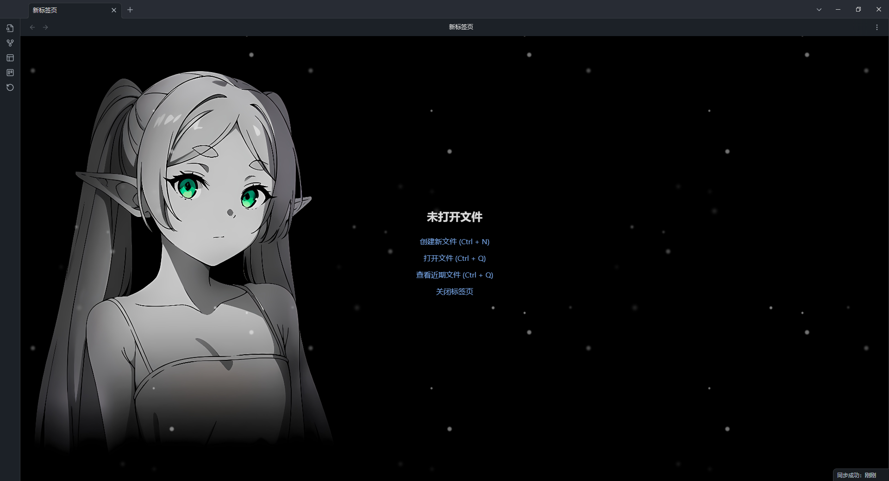
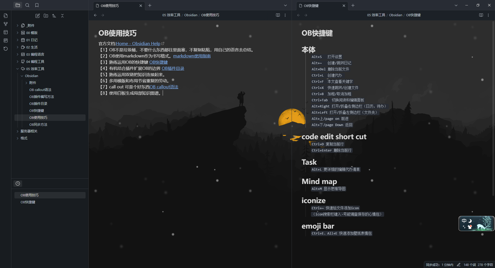

# obsidian 动态壁纸插件

Tag:obsidian、wallpaper、background、壁纸、背景

## 展示

## 简述

1. 这一个obsidian插件，能给obsidian添加带有动态效果的壁纸

    This obsidian plugin that can add wallpapers with dynamic effects to obsidian.

2. 这是一个基于现有插件的汉化扩展版本，更详细的说明和打赏请找[原作者](https://github.com/samuelsong70/obsidian-dynamic-background)。

    This is a sinicized and extended version base on the existing plug-in. For more     detailed instructions and tips, please contact [original author]([GitHub - samuelsong70/obsidian-dynamic-background: Adding dynamic background effects to the Obsidian editor](https://github.com/samuelsong70/obsidian-dynamic-background)).

## 使用

1. 把同名文件夹扔进.obsidian\plugins中
   
   Throw the folder into .obsidian\ plugins

2. 在第三方插件中打开动态壁纸
   Open 动态壁纸 in third-party plugins

3. 在选项中选择动效

4. 在选项中填入壁纸文件或文件夹关于项目的相对路径
   Fill with the vault relative path of  wallpaper file or folder 
   
   > [!NOTE]
   > 目前不支持将.obsidian作为相对路径
   > 
   > .obsidian is not supported as a relative path
   > 
   > 如果想remotely save时省点流量，可以使用_开头的文件夹或用黑名单
   > 
   > 使壁纸文件夹不会被纳入到同步中
   > 
   > If you want to save traffic when use remotely save
   > 
   > you can use the folder starting with _ or use blacklist to
   > 
   > make the wallpaper folder not included in the synchronization

5. 如果填了文件夹，每次启动OB时，都会随机从中选一张作为壁纸。
   If fill in the folder path, each time you start OB, it will randomly choose one from the folder as wallpaper.

6. 按Ctrl+R 可以随机换一张壁纸（若有）
   Press Ctrl + R to randomly change a wallpaper (if any)
   (因为没有写判重逻辑，有可能随到一样的(qwq)
   
   ## 其他
   
   1. 附带了一个小壁纸包，它们来自于[ wallhaven](https://wallhaven.cc/)。
      attach with a small wallpaper pack.They come from [wallhaven](https://wallhaven.cc/).
   
   2. 个人有需求的时候会加些新功能，现在鸽了。溜~

    
